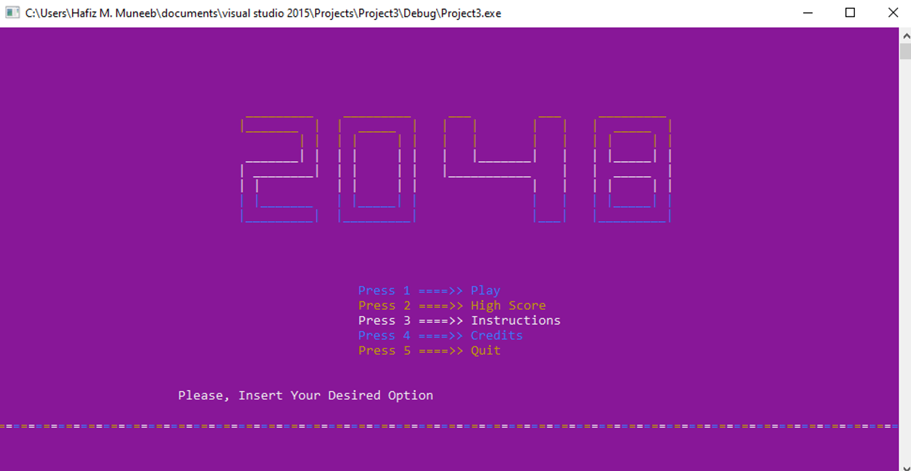
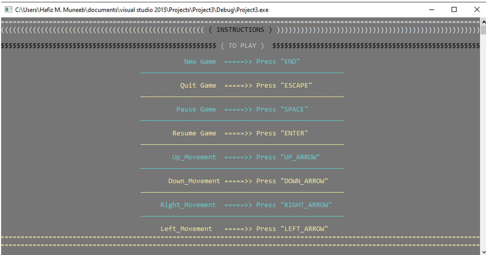
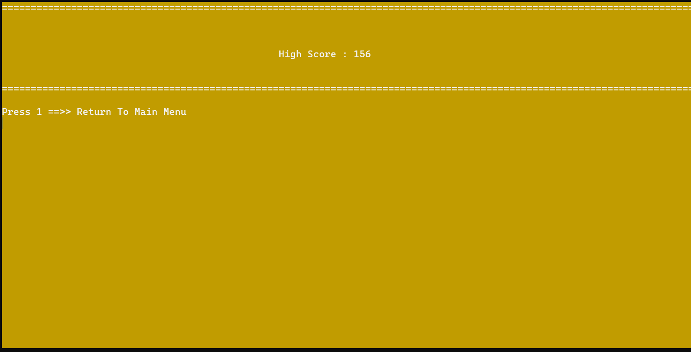
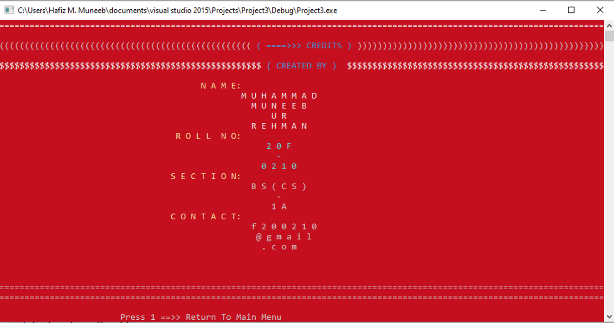
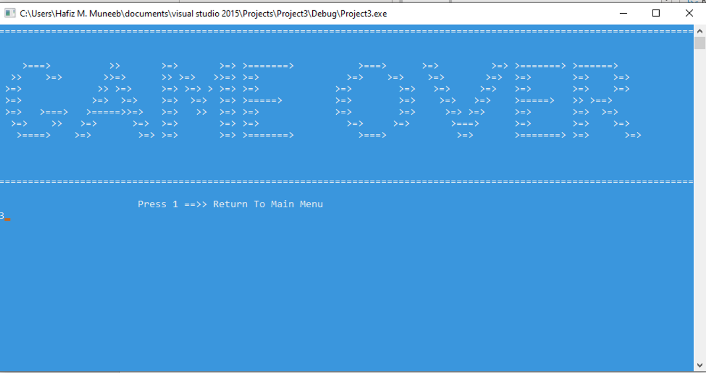

### The Journey Within: 2048 - A Harmonious Fusion of Numbers and Destiny**

*Unveiling the Divine Symmetry of Your Mind*

Behold, intrepid traveler, for you have embarked upon a journey where numbers dance and destiny reveals its secrets. Welcome to the ethereal realm of 2048, a captivating creation that transcends the boundaries of mere entertainment. Within the realm of this poetic masterpiece lies a world where symmetry, strategy, and the profound beauty of numbers converge.

## I. The Prelude: A Majestic Main Menu**

As you embark on this wondrous voyage, you shall first encounter the celestial Main Menu, resplendent in its simplicity. It is here that you shall choose your path and witness the universe of possibilities unfolding before your eyes. Allow the gentle melodies to guide your steps, for they shall orchestrate your every move within this captivating realm.

## II. The Dance of Numbers: A Melody of Logic and Chance**

As the ethereal symphony of 2048 envelops your senses, prepare to immerse yourself in a dance of numbers that transcends the mundane. With every swipe of your fingers, the enchanting tiles merge and unite, revealing hidden harmonies that defy explanation. Through calculated strategy and instinctive intuition, you shall strive to reach the illustrious number that bestows upon you the ultimate accolade: 2048.

**III. The Whisper of Wisdom: Illuminating Instructions**

Fear not, weary traveler, for within the depths of this realm, an all-knowing guide awaits. The Instructions, meticulously crafted with wisdom and grace, shall unveil the secrets of this mysterious realm. Learn the subtle art of merging, the dance of strategy, and the delicate balance between patience and swift action. Heed the whispers of this guide, and you shall discover the true essence of enlightenment within the embrace of 2048.

## IV. The Tapestry of Legends: A Symphony of High Scores**

As you traverse this enchanting realm, be mindful of the legends that came before you. Witness the celestial tapestry of High Scores, woven by masters of logic and keepers of the flame. Shall you rise among their ranks? Challenge your mind, unravel the secrets of the universe, and etch your name upon the sacred scrolls of greatness. Become a legend in your own right, and let the cosmos marvel at your prowess.

## V. The Final Overture: An Exit with Grace**

Every journey must reach its inevitable conclusion, dear wanderer. When the time comes to bid farewell to the realm of 2048, do so with grace and gratitude. Reflect upon the lessons learned, the memories forged, and the mysteries unraveled. Know that within the corridors of your mind, the echoes of this ethereal experience shall forever resonate.

##In Conclusion: An Invitation to the Soul**

Now, dear traveler, it is time for you to embrace the realm of 2048. Unleash the dormant depths of your spirit, for within these numbers lies a harmony that mirrors the symphony of your soul. Embark upon this voyage, with the wind of destiny at your back and the light of knowledge illuminating your path. May the enchantment of 2048 guide you towards the discovery of your truest self.

*Remember, wanderer, within the realm of 2048, numbers become poetry, strategy becomes art, and your journey becomes an eternal ode to the beauty of the mind.*
